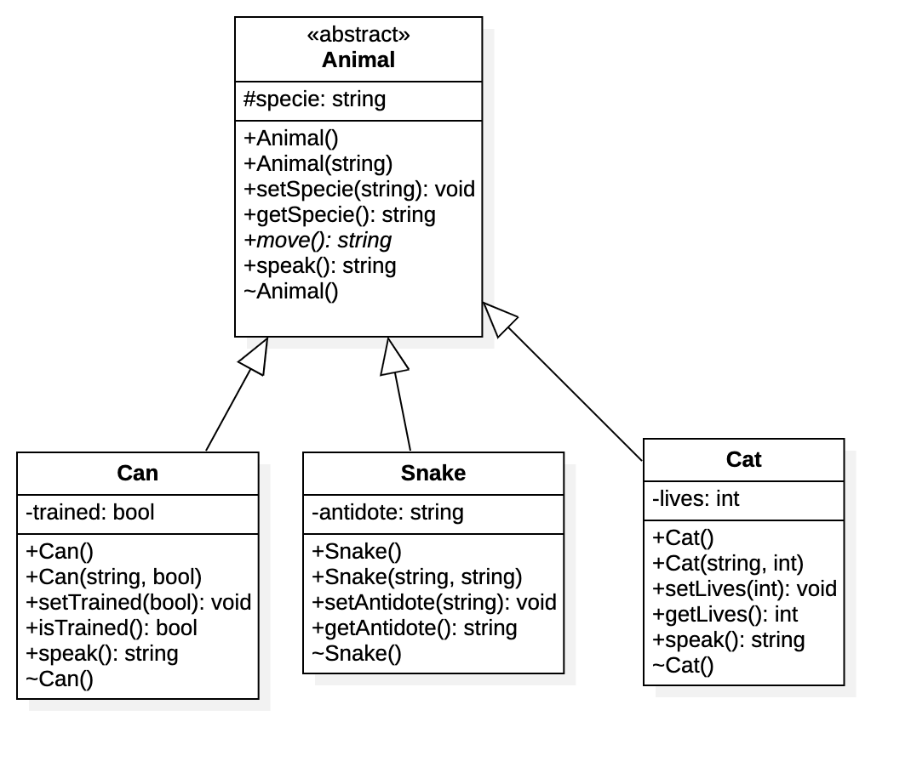

# Herencia con C++

Proyecto que describe un ejemplo de aplicación de Herencia en `C++`, se toma como base el siguiente Diagrama de Clases

##  Descripcion clases

El contexto es una jerarquía de animales, se tiene una clase base y tres clases extendidas

### Animal

Clase abstracta, define las generalidades de los animales. La implementación de los método se realiza dentro de la sección de la definicion de la clase.

#### Atributos

- __specie__ Indica la especie del animal

#### Métodos

- __Constructores__ Constructor vacío y constructor que recibe la especíe del _Animal_
- __Métodos de Interfaz__ Permiten establecer y retornar los valores del atributo de la clase
- __move__ Método virtual puro (abstracto), permite definir la clase como Abstracta, de la cual no se pueden crear instancia u objetos. Indica la forma en que se desplaza el Animal. Retonar un `string` descrbiendo el movimiento. Las clases que extienden o heredan de _Animal_, están obligadas a sobreescribir e implementar el método.
- __speak__ Método que se implementa en la clase base indicando que los Animales no hablan, se puede sobreescribir (_override_) en las clase extendidas para modificar el comportamiento por defecto.
- __destructor__ Se usa para ejecuta acciones al liberar la memoria del objeto.

### Can

Clase que hereda de `Animal` y define características y comportamiento de los perros. La implementación de los métodos se realiza dentro del mismo archivo de cabecera (Can.h), pero por fuera de la definición de la clase

#### Atributos

- __trained__ De tipo `bool`, indica si el perro está entrenado o no

#### Métodos

- __Constructores__ Constructor vacío y constructor que recibe la especíe y un valor `boolean` indicando si el perro esta entrenado o no
- __Métodos de Interfaz__ Permiten establecer y retornar los valores del atributo de la clase
- __speak__ Se sobreescribe el método de la clase base, cambiando el comportamiento de que `Los Animales no Hablan` por `Los perros dien Guau Guau`
- __destructor__ Se usa para ejecuta acciones al liberar la memoria del objeto.

### Snake

Clase que hereda de `Animal` y define características y comportamiento de las serpientes. La implementación de los métodos se realiza en un archivo externo (Snake.cpp) al archivo de cabeceras (Snake.h)

#### Atributos

- __antidote__ Atributo de tipo `string` que descibe el antídoto para el veneno de la serpiente

#### Métodos

- __Constructores__ Constructor vacío y constructor que recibe la descripción del antídoto
- __Métodos de Interfaz__ Permiten establecer y retornar los valores del atributo de la clase
- __destructor__ Se usa para ejecuta acciones al liberar la memoria del objeto.

### Cat

Clase que hereda de `Animal` y define características y comportamiento de los gatos. Al igual que en la clase anterior, la implementación de los métodos se realiza en un archivo externo (Cat.cpp) al archivo de cabeceras (Cat.h)

#### Atributos

- __lives__ Indica el número de vidas disponibles dek gato

#### Métodos

- __Constructores__ Constructor vacío y constructor que recibe la especíe y el númeo de vidas
- __Métodos de Interfaz__ Permiten establecer y retornar los valores del atributo de la clase
- __speak__ Se sobreescribe el método de la clase base, cambiando el comportamiento de que `Los Animales no Hablan` por `Los Gatos dien Miaauuu`
- __destructor__ Se usa para ejecuta acciones al liberar la memoria del objeto.

> Todas la clases base o extendidas deben implementar el método `move()`, porque es abstracto
